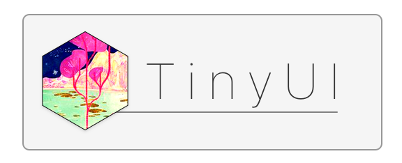

NOTE: This code is not ready for use yet. It can create basic things but the API changes frequently.

A tiny native windowing and GUI library for rust. Currently supports MacOS with other platforms in the future.

It does NOT use a render loop like winit and almost all other gui frameworks with rust do, but works closer with the native operating systems render loop and uses callbacks, so it is far better on cpu and lends itself more to long-running applications you don't want sucking your cpu in the background. It also feels a billion (quantified, honest) times nicer to work with than something like winit, which is turning into a slushy garbage dump as it progresses :D

Control names are stringly typed; this isn't likely to change in the future as to use a concrete type in this situtation is one of the (many) corner cases of rust, where it just doesn't work, and makes your code worse. Often UI developers will use complicated macros to get around simple problems, but here, stringly typed control ids during events are the simplest and least problematic method of use, and by far the easiest to understand. So this isn't likely to change in the future.

Lots of inspiration taken from https://deterministic.space/elegant-apis-in-rust.html#what-makes-an-api-elegant

Supports common controls like buttons and labels, and webkit (soon opengl) controls, natively, with absolute minimal dependencies. The library usage is loosely based on ggez.
